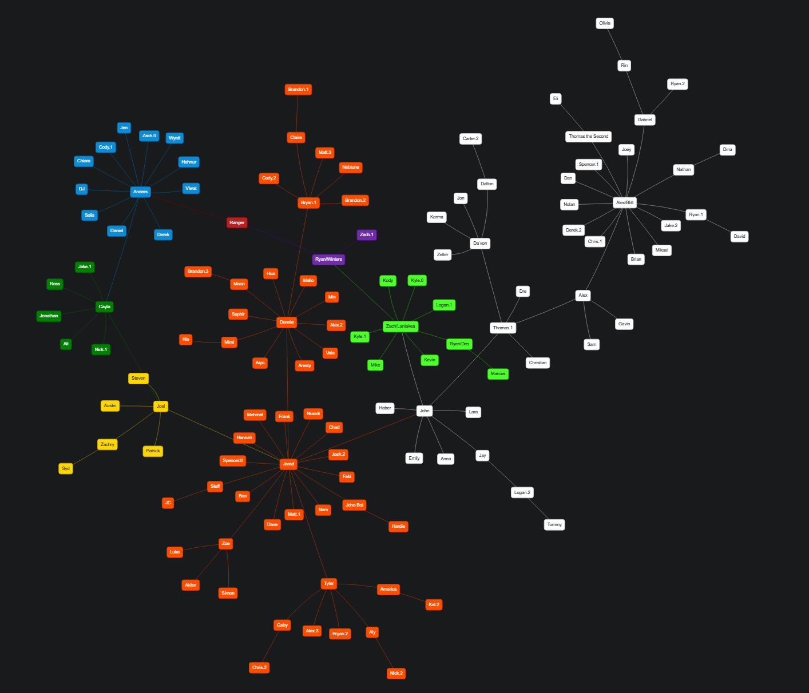

  

  A real-time Family Tree and Discord bot for the CoronaCatz server

 

## About

This project was created to help the CoronaCatz Discord community have an automated and interactive way of keeping track of their members in the server by automating the maintenance of their Family Tree diagram. The bot adds member relationships, handles username changes and members leaving, and pushes all these changes to a cloud database, which is visually displayed at [coronacatz.com](https://coronacatz.com).

Previously, the Family Tree diagram of the server was completely maintained by a single person. It needed to be generated manually every time a new member joined, and updated periodically to reflect any members changing their display names or leaving the server. This was repetitive and prone to data inacuracies, which lead to the creation of the Family Tree Bot and CoronaCatz website.

## Features

Some features and quality of life improvements include:
* ***Minimal user interaction***. Simply type a formatted message in the `family-tree` channel and the bot will automatically add a user to the Family Tree
* ***Real-time updates***. All member updates like username changes are captured when they happen, ensuring the server and Family Tree are in sync at all times
* ***Interactive visual graph***. Explore the Family Tree diagram in a responsive web app, which supports visual highlighting and movement physics

For more information on how the bot and web app work, visit the [bot](/bot) and [web](/web) directories respectively

## Development Features

If you would like to include the bot in your server or host it yourself, some developer features you will find included are:
* Logging, tracing, and metric data exported using OpenTelemetry
* A local development environment, including a dev container and OpenTelemetry backend container to capture and visualize telemetry data
* A comprehensive CI/CD workflow to run tests, build a bot container image, and deploy to GHCR

## Built With
* TypeScript
* React
* vis-network
* Node.js
* Prisma
* Discord.js
* Supabase
